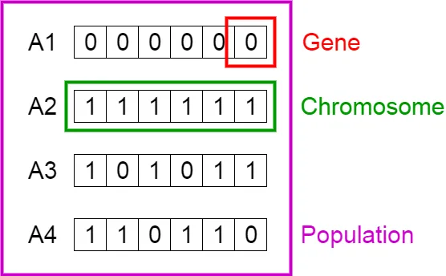
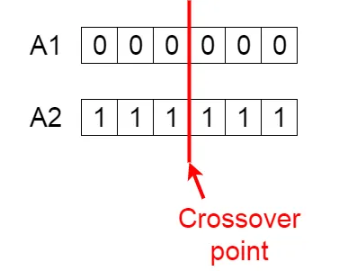
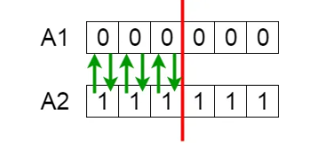
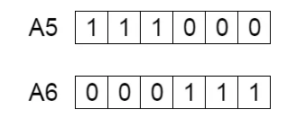
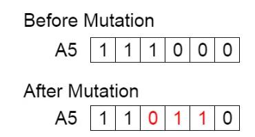

# Compute the maximum number of ones in a 32-bit array

## problem:
we need comput the maximum number of ones in a 32-bit array using GA
### solution phases:
Five phases are considered in a genetic algorithm.
1. Initial population
2. Fitness function
3. Selection
4. Crossover
5. Mutation
### 1. Initial Population:
The process begins with a set of individuals which is called a Population. 
Each individual is a solution to the problem you want to solve.

An individual is characterized by a set of parameters (variables) known as Genes. 
Genes are joined into a string to form a Chromosome (solution).

In this problem, the set of genes of an individual is represented using a boolean, 
Usually, binary values are used (boolean values). We say that we encode the genes in a chromosome.

### 2. Fitness function:
It gives a fitness score to each individual. The probability that an individual will be selected 
for reproduction is based on its fitness score.

### 3. Selection:
The idea of selection phase is to select the fittest individuals and let them pass their 
genes to the next generation.

50% of individuals (parents) are selected based on their fitness scores. 
Individuals with high fitness have more chance to be selected for reproduction.

### 4. Crossover:
Crossover is the most significant phase in a genetic algorithm. 
For each pair of parents to be mated, a crossover point is chosen at random from within the genes.

For example, consider the crossover point to be 3 as shown below.

Offspring are created by exchanging the genes of parents among themselves until 
the crossover point is reached.

The new offspring are added to the population.

### 5. Mutation:
In certain new offspring formed, some of their genes can be subjected to 
a mutation with a low random probability. 
This implies that some of the bits in the bit string can be flipped.

Mutation occurs to maintain diversity within the population and prevent premature convergence.